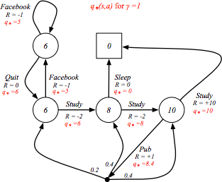

# PyMDP
PyMDP is a simple library for building and solving Markov decision processes.

## Installation
```
pip install pymdp
```
## Usage
The example below constructs this example MDP from David Silver's [lecture](http://www0.cs.ucl.ac.uk/staff/d.silver/web/Teaching_files/MDP.pdf):



```python
from pymdp import MDP

# Build the MDP
m = MDP()
a1 = m.add_action('a1')
a2 = m.add_action('a2')
a3 = m.add_action('a3')
m.add_transition('facebook', a1, 'facebook', -1)
m.add_transition('facebook', a2, 'class1', 0)
m.add_transition('class1', a1, 'facebook', -1)
m.add_transition('class1', a2, 'class2', -2)
m.add_transition('class2', a1, 'sleep', 0)
m.add_transition('class2', a2, 'class3', -2)
m.add_transition('class3', a1, 'sleep', 10)
m.add_transition('class3', a2, 'pub', 1)
m.add_transition('pub', a1, ['class1', 'class2', 'class3'], [0, 0, 0], [0.2, 0.4, 0.4])
m.make_terminal('sleep')

# Solve the MDP with reward discount factor set to 1.0 (no discount)
v = m.solve(discount=1.0)
```

## Bibtex
If you use this code in your work, you can cite it as follows:
```
@misc{jiang2016pymdp,
  author       = {Minqi Jiang},
  title        = {PyMDP},
  year         = 2018,
  url          = {https://github.com/minqi/pymdp}
}
```

## License
This project is licensed under the MIT License.